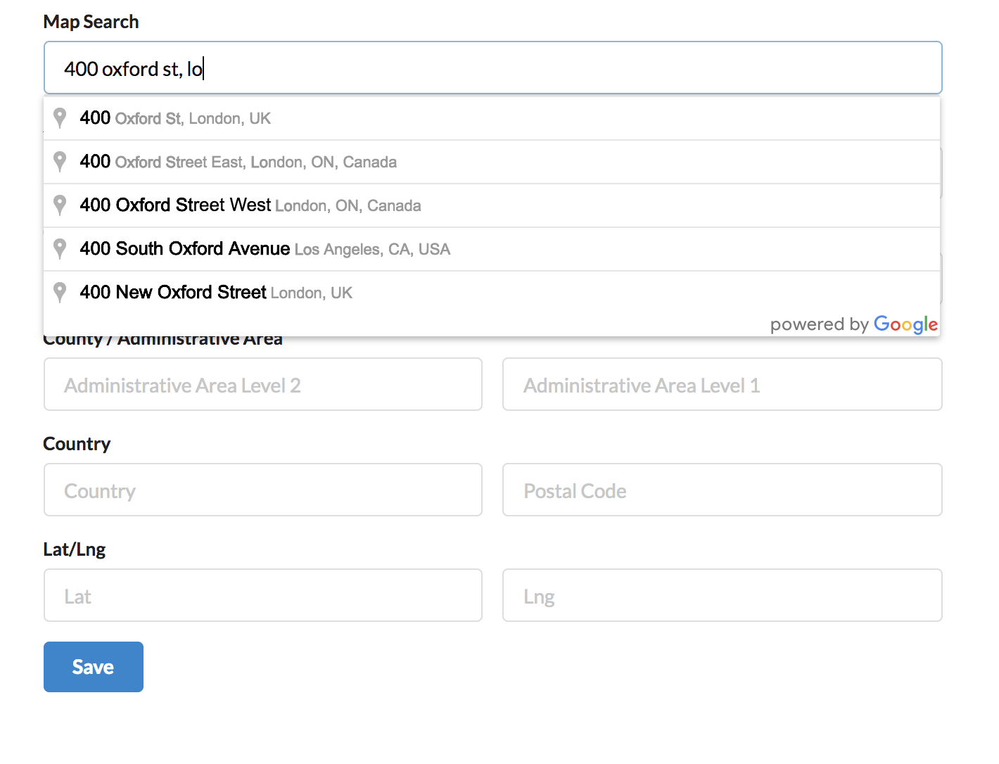

[ATK UI](https://github.com/atk4/ui) implements a high-level User Interface for Web App - such as **Admin System**. One of the most common things for the Admin system is a log-in screen.

This add-on will transform a form input field into a Google place autocomplete field. 
Once value is select in Goolge autocomplete, it will automatically populate other form 
input field. 

## Installation

Install through composer `composer require atk4/google-address`

## Example


Start typing in order to start gettings results from Google place api.



Then form field is populate automatically when a place is select from the dropdown.


## Usage

First setup your Google Api developer key within the map loader.

```
JsLoader::setGoogleApiKey('YOUR_API_KEY');
```

Simply add the google-address form control in your form.

```
$f->addControl('map_search', [new atk4\GoogleAddress\AddressLookup()]);
```

When added to the form, the control will try to populate other inputs in form 
with value return by the Places Api. 
For this to happen, a control name must match any of the Types name return by Google Places api.

Consider adding this control to your form:

```
$street = $f->addControl(Type::STREET_NUMBER);
```

When a return value from the Places autocomplete dropdown is select, then `$street` control value will be set  
using result form Place Api.

### Specifying value to specific control.

```
AddressLookup::onCompleteSet(Control $formControl, Build $builder): self
```

This method will try to set the `$formControl` with value return by `$builder` when user select
a place.

#### Example

Let's say form has a control for which you would like to set its value with return results 
from the Places api. Furthermore, you would like to use multiple values from Places Api in 
order to set the control value with. 

For example the street_number and the route value.

```
/** @var AddressLookup $ga */
$ga = $form->addControl('map_search', [AddressLookup::class]);
$address = $form->addControl('address');

// '444 street name'
$a_value = Build::with(Value::of(Type::STREET_NUMBER))->concat(Value::of(Type::ROUTE))->glueWith(' ');

$ga->onCompleteSet($address, $a_value);
```

See demos file for more information.